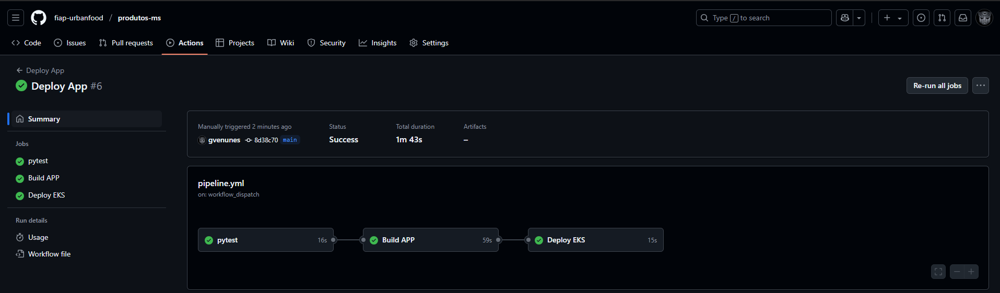
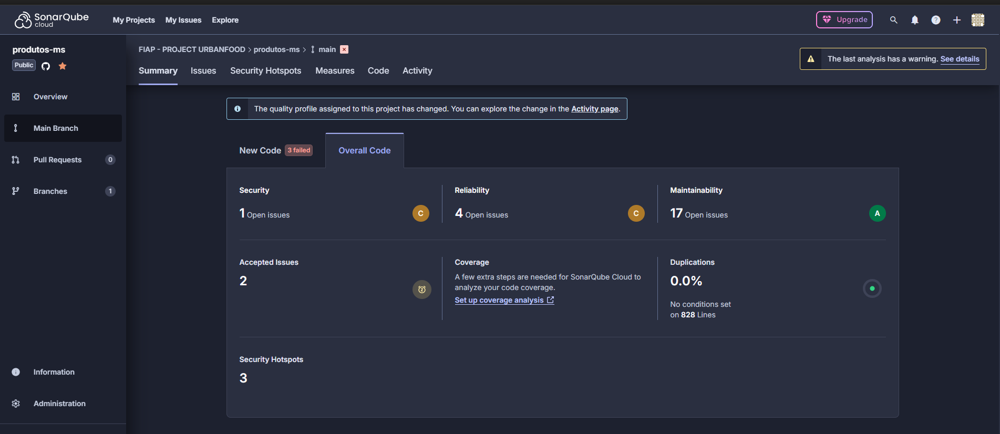
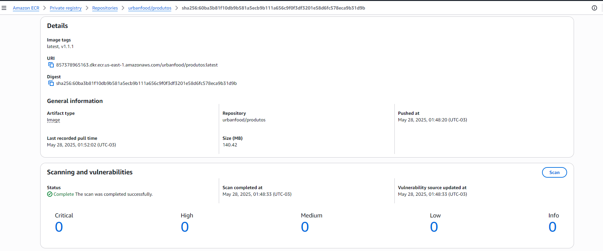
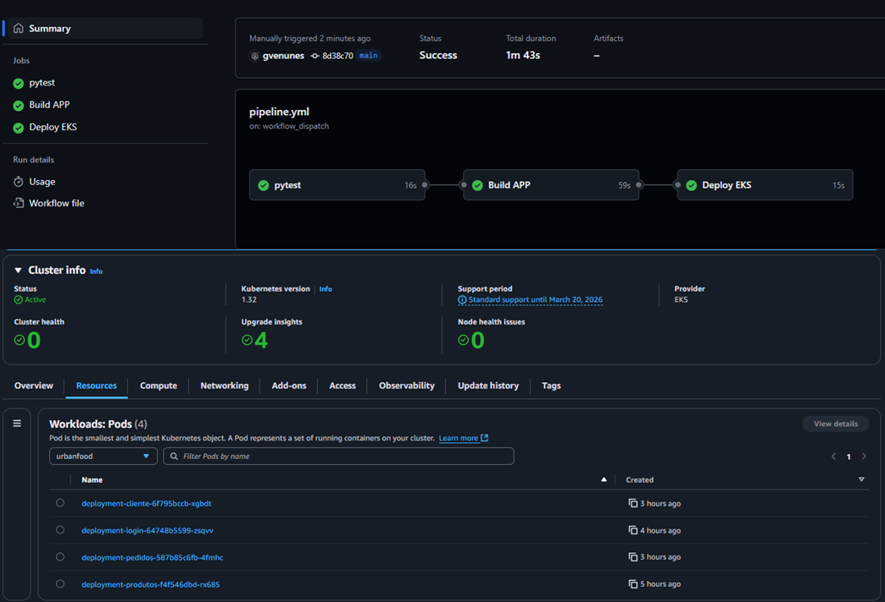

# 💻 Projeto spv_login

Sistema de Processamento de Vídeo (Micro serviço de Login)

# ###########################################################
# 💻 Deploy via Github Actions

### Executando o CI/CD

Etapas do Pipeline via github actions:

1.1 Build da Applicação:


1.2 Sonar para análise e monitoramento contínuo da qualidade do código.


1.3 Push da Imagem para o ECR.


1.4 Deploy no EKS.


# ###########################################################
# 💻 Deploy via DockerFile

### 1. Preparar o ambiente para gerar o pacote
1.1 Exemplo de como criar as Variáveis de Ambiente..
``` bash
export API_IMAGE_TAG='1.0.0'
export AWS_REGION='us-east-1'
export AWS_ACCOUNT='857378965163'
```

1.2 Docker Build na raiz do projeto..
``` bash
docker build --no-cache --progress=plain -f devops/Dockerfile -t app-login:$API_IMAGE_TAG .
docker tag app-login:$API_IMAGE_TAG $AWS_ACCOUNT.dkr.ecr.$AWS_REGION.amazonaws.com/spv_login/login:$API_IMAGE_TAG
docker tag $AWS_ACCOUNT.dkr.ecr.$AWS_REGION.amazonaws.com/spv_login/login:$API_IMAGE_TAG $AWS_ACCOUNT.dkr.ecr.$AWS_REGION.amazonaws.com/spv_login/login:latest
```

1.3 Docker Login ECR..
``` bash
aws ecr get-login-password --region $AWS_REGION | docker login --username AWS --password-stdin $AWS_ACCOUNT.dkr.ecr.$AWS_REGION.amazonaws.com
```

1.4 Docker Push do APP..
``` bash
docker push $AWS_ACCOUNT.dkr.ecr.$AWS_REGION.amazonaws.com/spv_login/login:$API_IMAGE_TAG
docker push $AWS_ACCOUNT.dkr.ecr.$AWS_REGION.amazonaws.com/spv_login/login:latest
```

1.5 Rodando o container local..
``` bash
docker run -dit -p 8003:8003 --name=app-login app-login:$API_IMAGE_TAG
```

1.6 Acesso a API..
``` bash
http://localhost:8000/health
```

# ###########################################################
# 💻 Deploy no EKS

## Processo Automatizado via Github Actions

## Configuração do kubectl

2.1 Configurar o acesso ao cluster
``` bash
aws eks update-kubeconfig --region us-east-1 --name k8s-urbanfood --profile terraform-iac
```

2.2 Entramos no diretório do k8s para subir o ambiente.
``` bash
cd k8s/
kubectl apply -f aws-auth.yml
kubectl apply -f namespace.yml
```

2.3 Acessando o namespace, "Após já ter sido criado"
``` bash
kubectl config set-context --current --namespace=login
```

Após criar e configurar a infra executamos o github actions do projeto. 

Para documentar: 

2.4 Para subir a aplicação de forma manual:
``` bash
kubectl apply -f app/login-configmap.yaml
kubectl apply -f app/login-service.yaml
kubectl apply -f app/login-hpa.yaml
kubectl apply -f app/login-deployment.yaml
```
